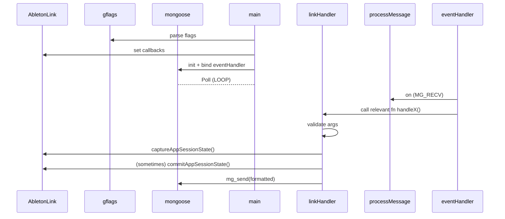

```mermaid
sequenceDiagram

participant AbletonLink
participant gflags
participant mongoose
participant main

participant linkHandler

participant processMessage
participant eventHandler


main ->> gflags: parse flags
main ->> AbletonLink: set callbacks
main ->> mongoose: init + bind eventHandler
main-->mongoose: Poll (LOOP)

eventHandler ->> processMessage: on (MG_RECV)
eventHandler ->> linkHandler: call relevant fn handleX()
linkHandler ->> linkHandler: validate args

linkHandler ->> AbletonLink: captureAppSessionState()
linkHandler ->> AbletonLink: (sometimes) commitAppSessionState()
linkHandler ->> mongoose: mg_send(formatted)


```