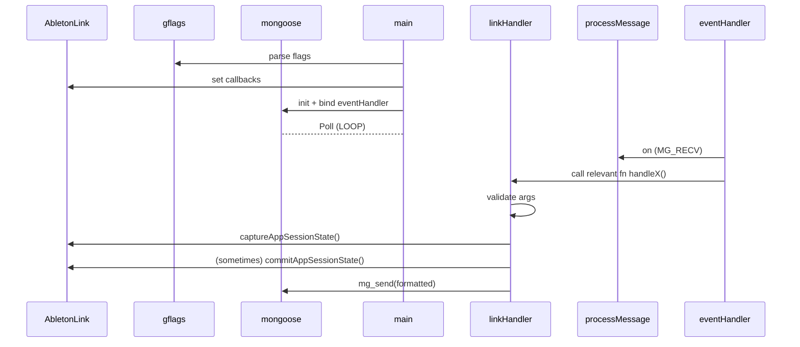
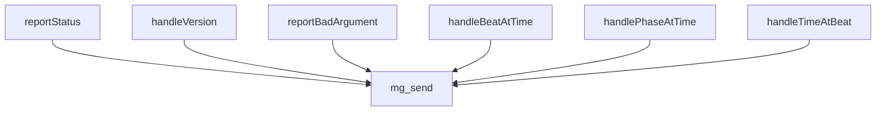

# Carabiner architecture

## NOTE

This document is simply a summary of my own research into Carbiner's architecture.

The purpose was to understand it well enough to be reuse as much as possible when modifying it to use OSC.

Documenting here for reference.

**it may be incomplete, partially incorrect, or no longer accurate.**

 

## Initialization flow

# Network send flow

# Modifications
1. `Carabiner.cpp`
    * Replaced `mg_send` calls with `send` function
    * if `SEND_OSC` flag: send an OSC message instead of `mg_send`
2. `osc_handler.cpp` - added function to handle OSc
3. `CMakeLists.txt` - support for new `osc_handler` library / linking